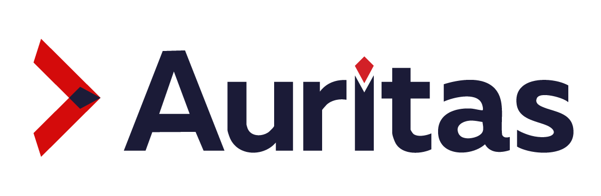

# ASM+ Google Cloud Marketplace

  
  &nbsp;&nbsp;&nbsp;
  

## Overview

Auritas Storage Manager (ASM+) is an enterprise document management application
for SAP environments. It centralizes document storage and access, connects
documents with SAP business processes, SAP SuccessFactors, and the Snowflake
platform, and provides web interfaces for administration, search, and document
viewing.

This Google Cloud Marketplace package deploys ASM+ inside the customer's own
Google Cloud project and network using Terraform and Helm. The deployment
provisions a dedicated VPC, a GKE cluster, Cloud SQL for PostgreSQL, Cloud
Storage, Secret Manager, Workload Identity, HTTPS ingress, and the ASM+
application services. The customer retains control of the infrastructure,
application data, networking, secrets, backups, scaling, and Google Cloud
resource costs.

ASM Storage API is the central application API. Optional SAP Business and SAP
SuccessFactors connectors integrate with customer-approved systems and
credentials.

- [Deployment and User Guide](docs/USER_GUIDE.md)
- [Example Infrastructure Manager inputs](examples/asm-plus.tfvars.example)
- [Security and support](SECURITY.md)

The deployable Terraform module, Helm chart, and container images are released
and validated through Google Cloud Marketplace. This repository does not
contain credentials, customer data, Terraform state, or private application
source code.

Copyright Auritas LLC. All rights reserved.
